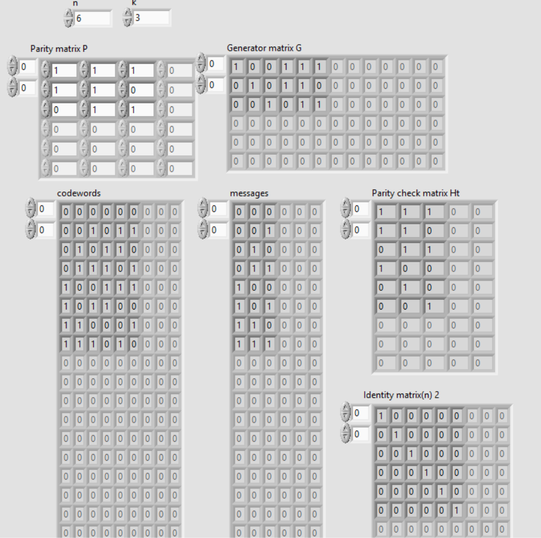
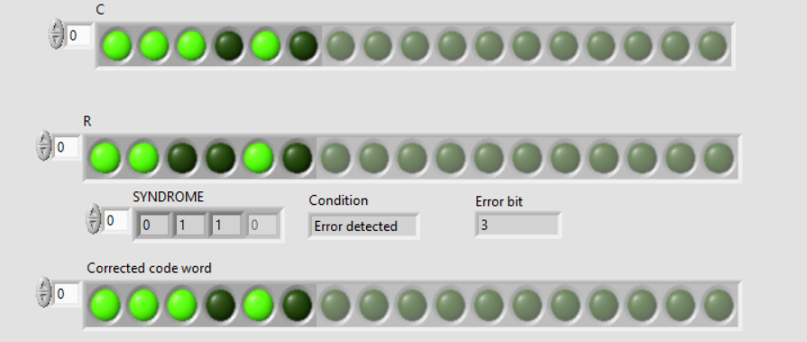

# Error_detection_and_correction

Error detection and correction using standard arrays. Labview IDE is used throught the whole process,all intermediate matrices are generated and displayed for verification and use as functions. 
Steps: 
1.enter the length of code word(n) and the length of message (k) 
2.enter the parity matrix. A list of allowed code words will be displayed for all the possible messages 
3.Select the code word to be transmitted through array C 
We are generating random bits of noise that distorts the entered code word , this represets the interferances 
Array R represents the received code word and the last array is the corrected code word obtained by using the standard array.

